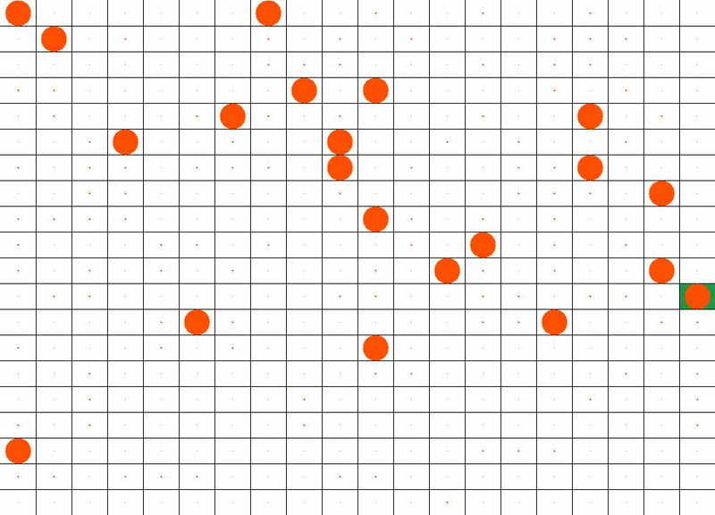

# Hi, I'm Dana 👋

### 🚀 Software Engineer & Co-op Student @ Algonquin College
**Bridging the gap between High-Level Web Ecosystems and Low-Level Robotics.**

I am currently mastering Full-Stack development, while leveraging a deep background in **ROS2**, **MLOps**, and **In Silico Simulations** to build production-ready, intelligent applications.

---

### 💻 Technical Toolbox

| Category | Technologies |
| :--- | :--- |
| **Languages** | C#, Golang, Java, Python, C/C++|
| **Web & Backend** | ASP.NET Core, SQL Server, JavaScript, HTML5/CSS3 |
| **Robotics & Systems** | ROS2, Embedded Systems, Linux |
| **DevOps & MLOps** | Docker, CI/CD Pipelines, Git, Shell Scripting |

---

### 🧠 Machine Learning & AI
* **Frameworks:** PyTorch, Keras, MMPretrain, Scikit-learn
* **NLP & GenAI:** LangChain, Hugging Face, NLTK
* **Data Science:** Pandas, NumPy, Matplotlib, OpenCV

---

### ⚙️ DevOps, MLOps & CI/CD
* **Automation:** Building automated **CI/CD pipelines** to streamline testing and deployment.
* **Containerization:** Utilizing **Docker** to ensure environment parity across development and production.
* **Model Lifecycle:** Implementing **MLOps** principles to manage the transition from research to scalable deployment.

---

### 🧪 Featured Project: In Silico Slime Simulation
**An agent-based simulation modeling the emergent behavior of *Physarum polycephalum*.**

* **The Tech:** Built using **PyTorch** for GPU-accelerated tensor operations, **NumPy** for data handling, and **OpenCV** for real-time frame rendering.
* **The Logic:** Implemented decentralized sensory-motor loops. 
* **The Result:** High-performance modeling of biological foraging patterns through parallelized agent updates.

> [!TIP]
> 

---

### 🎓 Education
* **Graduate Degree in Artificial Intelligence**
    * *Algonquin College (Expected April 2026)*
    * Focus: Artificial Intellignece, Full Stack Web Development,.
* **Honours BSc Computer Science & Minor of Philosophy**
    * *University of Ottawa (April 2023)*
    * Focus: AI, Simulations, Real-Time Systems
